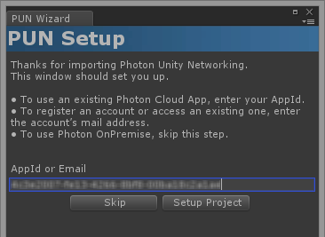

# **Photon Unity Network - Tutorial**

## **0 - Introduction**

The PUN Basic Tutorial is a Unity based tutorial. It will show you how to develop your own multiplayer enabled application powered by Photon Cloud and how to use Characters using Animator for their animations. We'll learn along the way many important features, tips and tricks to get a good overview of the approach to network based development with PUN.

## **Contents**

* [Overview](#Overview)
  * [Goal of the Game](#Goal-of-the-Game)
  * [What You Need to Know](#What-You-Need-to-Know)
* [Photon Cloud](#Photon-Cloud)
  * [Creating a New Unity Project](#Creating-a-New-Unity-Project)
  * [Importing PUN and Setup](Importing-PUN-and-Setup)
  * [Rooms](#Rooms)
  * [Lobby](#Lobby)
  * [Application IDs & Game Version](#Application-IDs-&-Game-Version)
  * [Regions](#Regions)
* [Development](Development)
* [Conclusion](Conclusion)

## **Overview**

This tutorial will guide you step by step throughout the whole creation process, starting from an empty project. Along the way, concepts will be explained, as well as common pitfalls and design considerations for networked games.

In order to not just have players walking around and do nothing, we'll implement a basic firing system coupled with a player's health management, which will help us support explanations for variable synchronization across the network.

We'll also be using a custom size arena based on the number of players in the room, the size of the arena being adjusted based on the number of player currently playing. This will be showing several concepts around automatically sync Scenes feature and tips on how to deal with players when loading different scenes and what could possibly go wrong in this scenario :)

### **Goal of the Game**

When the game is launched, the user will witness the connection protocol and be informed of the progress in the UI itself. When a Room is joined or created, the player enters an resizable Arena where up to 4 players may exist at a time. Players can run and turn, as well as fire. The beam fired by each player will affect the health of other players when hit. When your health is 0, it's game over and you leave the Arena. You are then presented with the intro screen again letting you start a new game if wanted.

### **What You Need to Know**

This tutorial assumes only the very basics of using the Unity Editor and programming. However, it's preferable to have a good knowledge and some experience with creating regular, non networked games in order to concentrate on the new concepts Photon Networking introduces.

The sample code is written in C#.

## **Photon Cloud**

### **Creating a New Unity Project**

Make sure you work with either a Unity version equal or higher than 5.3.7p4. Create a fresh Project, this is recommended when working on tutorials in general. Then once you have assimilated concepts and design patterns, apply them back to your own projects.

### **Importing PUN and Setup**

Open the Asset Store and locate the PUN 2 asset and download/install it. Let Unity Recompile when you have imported all the PUN Assets.

The PUN Setup Wizard is there to help you with the network settings and offers a convenient way to get started with our multiplayer game: The Photon Cloud!

Cloud? Yes, Cloud. It's a bunch of Photon servers which we can use for our game. We will explain in a bit.

Using the Cloud with the "Free Plan" is free and without obligation, so for now we just enter our mail address and the Wizard does its magic.

New accounts get an "AppId" right away. If your mail address is already registered, you are asked to open the Dashboard. Login and fetch the "AppId" to paste it into the input field.

When the AppId is saved, we are done with this step.

So, what exactly does this "Photon Cloud" do?!

Basically, it's a bunch of machines with the Photon Server running on them. This "cloud" of servers is maintained by Exit Games and offered as hassle-free service for your multiplayer games. Servers are added on demand, so any number of players can be dealt with.

Even though Photon Cloud is not completely free, the costs are low, especially compared to regular hosting. Read more about the pricing here.

Photon Unity Networking will handle the Photon Cloud for you but this is what's going on internally in a nutshell:

Everyone connects to a "Name Server" first. It checks which app (with the AppId) and which region the client wants to use. Then it forwards the client to a Master Server.

The Master Server is the hub for a bunch of regional servers. It knows all existing games. Any time a game (room) gets created or joined, the client gets forwarded to one of the other machines - called "Game Server".

The setup in PUN is ridiculously simple and you don't have to care about hosting costs, performance or maintenance. Not once.

### **Rooms**

The Photon Cloud is built with "room-based games" in mind, meaning there is a limited number of players (let's say: less than 10) per match, separated from anyone else. In a room (usually) everyone receives whatever the others send. Outside of a room, players are not able to communicate, so we always want them in rooms as soon as possible.

The best way to get into a room is to use Random Matchmaking. We just ask the server for any room or a room with certain properties.

All rooms have a name as identifier. Unless the room is full or closed, we can join it by name. Conveniently, the Master Server can provide a list of rooms for our app.

### **Lobby**

The lobby for your application exists on the Master Server to list rooms for your game. In our example, we will not make use of the lobby and simply join a random room if one is available, or create a new room if no existing room can be joined (rooms can have a maximum capacity, and so they can potentially be all full).

### **Application IDs & Game Version**

If everyone connects to the same servers, there must be a way to separate your players from everyone else's.

Each game (as in application) gets its own "AppId" in the Cloud. Players will always meet other players with the same "AppId" in their client only.

There is also a "game version" you can use to separate players with older clients from those with newer ones.

### **Regions**

The Photon Cloud is organized in separate Regions across the globe to prevent bad connections against players potentially too far away. It's important to understand this concept especially when working with remote teams spread in different regions. Testing your games with your teammates may not be possible because of the region splits. So make sure you force the region to be the same for all the testers you want to interact with each other.

## **Development**

Each section covers a very specific part of the project development stage, it's important to work through them in order.
The level of assumptions on Scripting and Photon Knowledge also increases gradually.

1. Creating the basic Lobby Scene.
2. Improving the Lobby Scene with a User Interface (UI).
3. Creating the Game Scenes.
4. Implementing Levels loading.
5. Creating the basic Player Prefab.
6. Making the camera follow your player.
7. Modifying the Player Prefab to add network features.
8. Player instantiation and scene switching.
9. Player User Interface (UI).

## **Conclusion**

So, we reached a working system, where user can play against each other over the Internet with the basic requirements for a good experience.

We've learn how to control PUN, how to listen to PUN status and current context, as well as making the most out of intuitive components to work with Animator effortlessly.

We've also learned some interesting features of Photon such as Automatic Scenes synchronization, to create original and powerful gameplays.

There is a lot more to do to create a complete game, ready for public, but this is only building on top of the foundations we've covered here.

* Make sure you read the "Get Started" section.
* Be curious, explore the documentation and API reference just to get a overall view of what's available. You'll likely not need everything straight away, but it will come back to memory when you will need it, or when implementing a new feature. You'll remember that some methods or properties were related, and so it's time to learn properly about them.
* Make use of the Forum, don't hesitate to share your problems, issues, and even frustrations :) it's essential that you do not get stuck with a problem. By having to write about it for others to understand your issue, you will formulate it outside your brain, which is known to help solving problems. There is no such thing as stupid questions, it all depends on your level of expertise and how far you are in learning/mastering Unity and PUN.