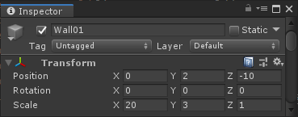
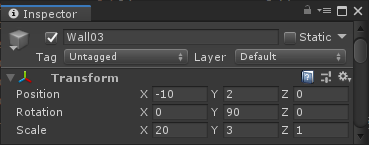
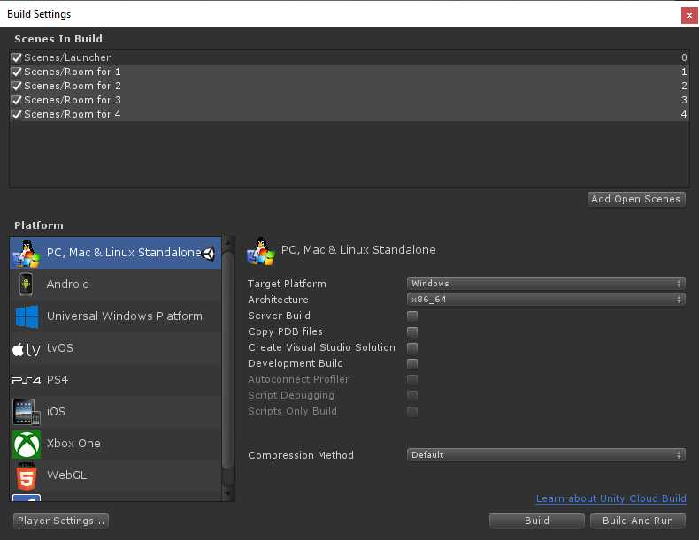

# Photon Unity Network Tutorial

## 3. Game Scenes

This section covers the creation of the various scenes where players will be playing.

Each scene will be dedicated for a specific number of players, getting bigger and bigger to fit all players and give them enough space to move around.

Further down this tutorial, we'll implement the logic to load the right level based on the number of players, and for this we'll use a convention that each level will be name with the following format: "Room for X" where X will represent the number of players.

## **Contents**

* [First Room Creation](#First-Room-Creation)
* [Game Manager Prefab](#Game-Manager-Prefab)
* [Quit Room Button Pre](#Quit-Room-Button-Prep)
* [Other Rooms Creation](#Other-Rooms-Creation)
  * [Room for 2](#Room-for-2)
  * [Room for 3](#Room-for-3)
  * [Room for 4](#Room-for-4)
* [Build Settings Scene List](#Build-Settings-Scene-List)

* [Full Source Code](#Full-Source-Code)
  * [GameManager.cs](#GameManager.cs)

## **First Room Creation**

1. Create a new scene, save it and name it exactly `Room for 1`.
2. Create a Cube and name it `floor`.
3. Position it at `0,0,0`. It's important as our logic system will spawn players above the center (0,x,0).
4. Scale the floor to `20,1,20`.

That would be sufficient here for a playable level, but some wall will keep the player within the floor area. Simply create more cubes and position, rotate and scale them to act as walls. Here's the position and scale of all four walls to match the `floor` GameObject

  

  

  

  

Don't forget the save Room For 1 Scene at this point.

## **Game Manager Prefab**

In all cases, the minimum requirement for a User Interface is to be able to quit the room. For this, we'll need a UI Button, but we'll also need a script that will call Photon to make the local player leave the room, so let's start by creating what we'll call the Game Manager prefab, and the first task it will handle quitting the room the local Player is currently in.

1. Create a new c# script `GameManager`.
2. Create an empty GameObject in the Scene, name it `GameManager`
3. Drop the `GameManager` script onto the `GameManager` GameObject.
4. Turn the `Game Manager` GameObject into a prefab by dragging it from the scene Hierarchy to the Assets Browser, it will turn blue in the Hierarchy.
5. Edit `GameManager` Script.
6. Replace with the following.

    ```c#
    using Photon.Pun;
    using UnityEngine.SceneManagement;

    namespace com.unity.photon
    {
        public class GameManager : MonoBehaviourPunCallbacks
        {
            #region MonoBehaviourPunCallbacks CallBacks

            /// <summary>
            /// Called when the local player left the room. We need to load the launcher scene.
            /// </summary>
            public override void OnLeftRoom()
            {
                SceneManager.LoadScene(0);
            }

            #endregion


            #region Public Methods

            public void LeaveRoom()
            {
                PhotonNetwork.LeaveRoom();
            }

            #endregion
        }
    }
    ```

7. Save the `GameManager` script.

So, we've create a public method `LeaveRoom()`. What it does is explicitly making the local player leave the Photon Network room. We wrapped it around our own public method for abstraction. We may want at a later stage implement more features, such as saving data, or insert a confirmation step that the user will be leaving the game, etc.

Based on our game requirements, if we are not in a room we need to show the `Launcher` scene, so we are going to listen to `OnLeftRoom()` Photon Callback and load the lobby scene `Launcher`, which is indexed `0` in the `Build settings` scene's list, that we'll setup in the Build Settings Scene List section of this page.

But why do we make a prefab out of this? Because our game requirement implies several scenes for the same game, and so we'll need to reuse this `GameManager`. In Unity the best way to reuse GameObjects is to turn them into prefabs.

Next, let's create the UI Button that will call our `GameManager` `LeaveRoom()` method.

## **Quit Room Button Prep**

Again, like the `GameManager`, in the perspective that we'll have many different scenes in need of this feature, it makes sense to plan ahead and make the button a prefab so that we can reuse it and modify it in one place only if we need to in the future.

1. Make sure you are in the Scene `Room for 1`.
2. Create a `UI` `Panel` using the Unity menu `GameObject > UI > Panel`, name that panel `TopPanel`.
3. Remove the `Image` and `Canvas Renderer` Components to clear this panel. Keep it if you find it nicer, this is aesthetic.
4. Set the vertical Anchor Presets to top and horizontal anchor preset to stretch while holding Shift and Alt. RectTransform Anchors takes some experience to get used to it, but it's worth it :)
5. Set the `RectTransform` `height` to `50`.
6. Right click on the Panel GameObject `TopPanel` and add a `UI > Button - TextMeshPro`, name it `LeaveButton`.
7. Select the `Text` Child of the `LeaveButton`, and set it's text to `Leave Game`.
8. Connect the `OnClick` button's event to the `GameManager` instance in the hierarchy to call `LeaveRoom()`.
9. Turn `LeaveButton` into a prefab by dragging it from the scene Hierarchy to the Assets Browser, it will turn blue in the Hierarchy.
10. Save the scene, and save the Project

## **Other Rooms Creation**

### **Room for 2**

### **Room for 3**

### **Room for 4**

## **Build Settings Scene List**

Critical to the good operation of the Project while editing and when published, we need to add all these scenes in the Build Settings so that Unity include them when building the application.

1. Open the Build Settings via the menu `File > Build Settings`
2. Drag and drop all the scenes, The launcher scene must remain the first, as by default Unity will load and show to the player the first scene on that list:



Now that we have your basic scenes setup, we can finally start hooking everything up. Let's do this in the next section.

## **Full Source Code**

### **GameManager.cs**

<details>
    <summary>
        Click to see 'GameManager.cs'
    </summary>
    <p>

```c#
using Photon.Pun;
using UnityEngine.SceneManagement;

namespace com.unity.photon
{
    public class GameManager : MonoBehaviourPunCallbacks
    {
        #region MonoBehaviourPunCallbacks CallBacks

        /// <summary>
        /// Called when the local player left the room. We need to load the launcher scene.
        /// </summary>
        public override void OnLeftRoom()
        {
            SceneManager.LoadScene(0);
        }

        #endregion


        #region Public Methods

        public void LeaveRoom()
        {
            PhotonNetwork.LeaveRoom();
        }

        #endregion
    }
}
```

</p>
</details>

<div style="text-align: right">

[Back to Top](#Photon-Unity-Network-Tutorial)

</div>